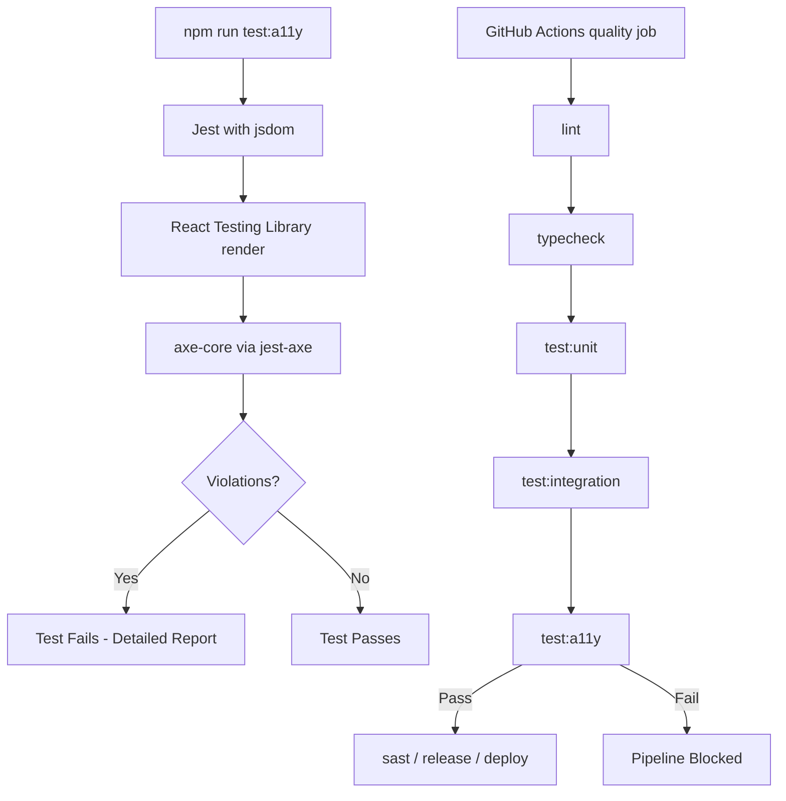

# Design Document: Accessibility Pipeline Tests

## Overview

This design adds automated WCAG 2.1 Level AA accessibility testing to the James Williams Music website using jest-axe (axe-core wrapper for Jest). The tests render each page route with React Testing Library, run axe-core validation against the rendered HTML, and integrate into the existing CI quality gate.

Key design decisions:
- **jest-axe** integrates directly with the existing Jest + React Testing Library setup — no new test runner needed
- **Server components are tested via their client-rendered output** by mocking async data fetchers and rendering the component tree
- **One test file per page route** keeps the structure predictable and extensible
- **Pipeline placement after unit/integration tests** ensures faster tests catch issues first before the slower accessibility scan runs

## Architecture



### Jest Configuration Strategy

The existing `jest.config.ts` uses a single config with `jsdom` environment and `roots: ['<rootDir>/tests']`. Since the accessibility tests live in `tests/accessibility/`, they are already covered by the existing root path. The dedicated `test:a11y` script uses `--testPathPattern=tests/accessibility` to run only a11y tests.

No changes to `jest.config.ts` are needed — the existing configuration (jsdom environment, ts-jest transform, module name mapping) works for accessibility tests.

### jest-axe Setup

```typescript
// tests/accessibility/setup.ts
import 'jest-axe/extend-expect';
```

This setup file extends Jest's expect with the `toHaveNoViolations` matcher. It's included via Jest's `setupFilesAfterFramework` or imported directly in test files.

## Components and Interfaces

### Test Helper: `renderAndCheckA11y`

A shared utility that encapsulates the render → axe scan → assert pattern:

```typescript
// tests/accessibility/helpers.ts
import { render, RenderResult } from '@testing-library/react';
import { axe, toHaveNoViolations, AxeResults } from 'jest-axe';
import type { ReactElement } from 'react';

expect.extend(toHaveNoViolations);

export interface A11yTestOptions {
  /** axe-core rules to disable for this test */
  disabledRules?: string[];
}

export async function renderAndCheckA11y(
  ui: ReactElement,
  options: A11yTestOptions = {}
): Promise<AxeResults> {
  const { container } = render(ui);

  const axeOptions: Parameters<typeof axe>[1] = {
    runOnly: {
      type: 'tag',
      values: ['wcag2a', 'wcag2aa', 'wcag21a', 'wcag21aa'],
    },
  };

  if (options.disabledRules?.length) {
    axeOptions.rules = Object.fromEntries(
      options.disabledRules.map((rule) => [rule, { enabled: false }])
    );
  }

  const results = await axe(container, axeOptions);
  expect(results).toHaveNoViolations();
  return results;
}
```

### Test File Pattern

Each page route gets a dedicated test file:

```typescript
// tests/accessibility/login.a11y.test.tsx
import { renderAndCheckA11y } from './helpers';
import LoginPage from '@/app/(auth)/login/page';

// Mock async dependencies
jest.mock('@/lib/webiny/api');

describe('Accessibility: /login', () => {
  it('has no WCAG 2.1 AA violations', async () => {
    await renderAndCheckA11y(<LoginPage searchParams={Promise.resolve({})} />);
  });
});
```

### Handling Server Components

Next.js App Router pages are async server components. In the Jest/jsdom environment they need special handling:

1. **Pages with async data fetching** (homepage, exclusive): Mock the data-fetching functions (`getHero`, `getTourDates`, etc.) to return fixture data, then render the component. Since Jest handles async components via React 18's rendering, the component resolves its `await` calls against the mocked data.

2. **Pages with `cookies()` or `headers()`** (exclusive, account): Mock `next/headers` to return controlled values.

3. **Pages with only client component children** (login, signup, forgot-password): These are simpler — the server component is a thin wrapper that renders a client component. Mock `next/navigation` for router hooks.

```typescript
// Mock pattern for pages using next/headers
jest.mock('next/headers', () => ({
  cookies: () => ({
    get: jest.fn().mockReturnValue({ value: 'mock-token' }),
  }),
}));
```

### File Structure

```
tests/
├── accessibility/
│   ├── helpers.ts              # renderAndCheckA11y utility
│   ├── fixtures/               # Mock data for page rendering
│   │   └── webiny.ts           # Mock CMS responses
│   ├── homepage.a11y.test.tsx   # / route
│   ├── login.a11y.test.tsx      # /login route
│   ├── signup.a11y.test.tsx     # /signup route
│   ├── forgot-password.a11y.test.tsx  # /forgot-password route
│   ├── exclusive.a11y.test.tsx  # /exclusive route
│   └── account.a11y.test.tsx    # /account route
├── integration/
└── unit/
```

## Data Models

No persistent data models are introduced. The relevant data structures are:

### axe-core Results (from jest-axe)

```typescript
interface AxeResults {
  violations: AxeViolation[];
  passes: AxeResult[];
  incomplete: AxeResult[];
  inapplicable: AxeResult[];
}

interface AxeViolation {
  id: string;           // Rule ID (e.g., "color-contrast")
  impact: 'critical' | 'serious' | 'moderate' | 'minor';
  description: string;  // Human-readable description
  help: string;         // Short help text
  helpUrl: string;      // Link to documentation
  nodes: AxeNode[];     // Failing elements
}

interface AxeNode {
  html: string;         // The offending HTML element
  target: string[];     // CSS selector path
  failureSummary: string;
}
```

### Test Configuration

```typescript
interface A11yTestOptions {
  disabledRules?: string[];  // Rules to skip (with documented justification)
}
```

## Error Handling

### Test Failures

When jest-axe detects violations, the `toHaveNoViolations` matcher produces a formatted failure message that includes:
- Rule ID and impact level
- Description of the accessibility issue
- The offending HTML element
- A URL to the axe-core documentation for the rule

The test description (`describe('Accessibility: /login')`) ensures the page context is clear in CI output.

### Rendering Failures

If a page component throws during render (e.g., unmocked dependency), the test fails with a standard React/Jest error. This is handled by:
1. Comprehensive mocking of async dependencies in each test file
2. Clear error messages from Jest identifying which mock is missing

### Pipeline Failure Behavior

GitHub Actions treats any non-zero exit code as a step failure. When `npm run test:a11y` exits non-zero:
- The quality job fails immediately
- Subsequent jobs (`release`, `build-and-deploy`) are skipped due to the `needs: [quality, sast]` dependency
- The GitHub Actions log shows the full Jest output including violation details

### Rule Override Documentation

When a rule is disabled in a test file, it must include a comment explaining why:

```typescript
await renderAndCheckA11y(<MyPage />, {
  // Disabled: false positive on dynamically-inserted aria-live region
  // See: https://github.com/dequelabs/axe-core/issues/XXXX
  disabledRules: ['aria-allowed-attr'],
});
```

## Testing Strategy

### Why Property-Based Testing Does Not Apply

This feature is **test infrastructure configuration** — it wires together jest-axe, React Testing Library, and the CI pipeline. The acceptance criteria involve:
- Static page renders against fixed WCAG rules (no meaningful input variation)
- CI pipeline step ordering (configuration, not logic)
- npm script existence (configuration)
- Library integration (jest-axe output format)

There are no pure functions with universal properties. The "inputs" are page components with fixed markup, and the "output" is pass/fail from axe-core rules. Running the same test 100 times with different random inputs is meaningless here — the pages are deterministic.

### Unit Tests (Example-Based)

| Test | Validates |
|------|-----------|
| Each page renders without violations | Req 1.1, 1.4 |
| All 6 routes have test files | Req 1.2 |
| Violation output includes rule ID, impact, element, description | Req 1.3, 4.4 |
| axe runs with WCAG 2.1 AA tags configured | Req 3.2 |
| Rule override mechanism works | Req 3.3 |

### Integration/Smoke Tests

| Test | Validates |
|------|-----------|
| `npm run test:a11y` script exists and runs | Req 4.1, 4.2 |
| Pipeline step is in correct position | Req 2.1, 2.3 |
| Test files in `tests/accessibility/` directory | Req 4.3 |

### Pipeline Configuration (deploy.yml change)

```yaml
# In the quality job, after test:integration
- run: npm run test:a11y
```

### npm Script Configuration (package.json change)

```json
{
  "scripts": {
    "test:a11y": "jest --testPathPattern=tests/accessibility --passWithNoTests"
  }
}
```

### Dependencies to Add

```json
{
  "devDependencies": {
    "jest-axe": "^9",
    "@types/jest-axe": "^3"
  }
}
```
