# Implementation Plan

## Overview

This plan implements the fan accounts feature for the James Williams website, adding authenticated user accounts (AWS Cognito), exclusive content gating (Webiny CMS), notification preferences (DynamoDB), and email notifications (Amazon SES). Tasks are organized sequentially across foundation setup, auth service layer, auth API routes, auth UI, database/preferences, account management, exclusive content, and integration.

## Tasks

- [x] 1. Install npm packages
  - **Requirements:** Req 1, Req 2, Req 4, Req 5, Req 6
  - **Description:** Install production dependencies required for the fan accounts feature: authentication, validation, JWT handling, and AWS SDK clients.
  - **Files to create/modify:**
    - `package.json` - Add amazon-cognito-identity-js, @aws-sdk/client-cognito-identity-provider, @aws-sdk/client-dynamodb, @aws-sdk/lib-dynamodb, @aws-sdk/client-kms, zod, and jose to dependencies
  - **Acceptance criteria:**
    - `amazon-cognito-identity-js` ^6.3.0 added to dependencies
    - `@aws-sdk/client-cognito-identity-provider` ^3.600.0 added to dependencies
    - `@aws-sdk/client-dynamodb` ^3.600.0 added to dependencies
    - `@aws-sdk/lib-dynamodb` ^3.600.0 added to dependencies
    - `@aws-sdk/client-kms` ^3.600.0 added to dependencies
    - `zod` ^3.23.0 added to dependencies
    - `jose` ^5.6.0 added to dependencies
    - `npm install` completes without errors

- [x] 2. Create config module for Cognito environment variables
  - **Requirements:** Req 1, Req 2, Req 6
  - **Description:** Create a centralised configuration module that reads and validates all Cognito-related environment variables at startup.
  - **Files to create/modify:**
    - `src/lib/auth/config.ts` - Export typed config object with COGNITO_USER_POOL_ID, COGNITO_CLIENT_ID, COGNITO_REGION, COOKIE_DOMAIN, COOKIE_SECURE, NEXT_PUBLIC_APP_URL
  - **Acceptance criteria:**
    - Config module exports all Cognito env vars with TypeScript types
    - Throws descriptive error if required env vars are missing at runtime
    - Includes sensible defaults for COGNITO_REGION (ap-southeast-2) and COOKIE_SECURE (true)
    - Exports separate client-safe config (no secrets) for use in client components

- [x] 3. Update Dockerfile to pass new environment variables as build args
  - **Requirements:** Req 1, Req 2, Req 6
  - **Description:** Add Cognito and DynamoDB environment variables as Docker build arguments and runtime env vars in the Dockerfile.
  - **Files to create/modify:**
    - `Dockerfile` - Add ARG/ENV for COGNITO_USER_POOL_ID, COGNITO_CLIENT_ID, COGNITO_REGION, FAN_PREFERENCES_TABLE, FAN_DELETION_AUDIT_TABLE, KMS_KEY_ARN, COOKIE_DOMAIN, COOKIE_SECURE, NEXT_PUBLIC_APP_URL
  - **Acceptance criteria:**
    - All new env vars declared as ARG in builder stage
    - All new env vars set as ENV in runner stage
    - NEXT_PUBLIC_APP_URL available at build time (needed for Next.js static optimization)
    - Docker build still succeeds with existing Webiny vars

- [x] 4. Update deploy workflow to fetch Cognito SSM parameters
  - **Requirements:** Req 1, Req 2, Req 6
  - **Description:** Update the GitHub Actions deploy workflow to fetch Cognito and DynamoDB SSM parameters and pass them as Docker build args.
  - **Files to create/modify:**
    - `.github/workflows/deploy.yml` - Add step to fetch SSM params for Cognito pool ID, client ID, preferences table, audit table, and KMS key ARN; pass as build args to docker build
  - **Acceptance criteria:**
    - Workflow fetches `/jameswilliams/dev/cognito/user-pool-id` from SSM
    - Workflow fetches `/jameswilliams/dev/cognito/client-id` from SSM
    - Workflow fetches `/jameswilliams/dev/dynamodb/fan-preferences-table` from SSM
    - Workflow fetches `/jameswilliams/dev/dynamodb/fan-deletion-audit-table` from SSM
    - Workflow fetches `/jameswilliams/dev/kms/fan-data-key-arn` from SSM
    - All fetched values passed as --build-arg to docker build command
    - Existing Webiny SSM fetch step still works

- [x] 5. JWT verification utilities
  - **Requirements:** Req 2
  - **Description:** Implement JWT token verification using the jose library: fetch and cache Cognito JWKS, decode tokens, validate claims (iss, aud, exp, token_use).
  - **Files to create/modify:**
    - `src/lib/auth/tokens.ts` - JWKS fetcher with in-memory cache (TTL), token decode, signature verification, claim validation
  - **Acceptance criteria:**
    - Fetches JWKS from Cognito well-known endpoint
    - Caches JWKS in memory with configurable TTL (default 1 hour)
    - Verifies JWT signature against correct kid from JWKS
    - Validates `iss` matches Cognito user pool URL
    - Validates `token_use` claim (access vs id)
    - Validates `exp` claim and rejects expired tokens
    - Returns typed decoded payload on success
    - Throws descriptive errors for each failure mode

- [x] 6. Cognito client wrapper
  - **Requirements:** Req 1, Req 2, Req 9
  - **Description:** Create a service wrapper around amazon-cognito-identity-js and @aws-sdk/client-cognito-identity-provider for all authentication operations.
  - **Files to create/modify:**
    - `src/lib/auth/cognito.ts` - Functions: signUp, confirmSignUp, signIn, forgotPassword, confirmForgotPassword, globalSignOut, adminDeleteUser, refreshSession
  - **Acceptance criteria:**
    - `signUp` creates user with email and password, stores consent custom attributes
    - `confirmSignUp` verifies email with confirmation code
    - `signIn` authenticates via SRP and returns access, id, and refresh tokens
    - `forgotPassword` initiates password reset flow
    - `confirmForgotPassword` sets new password with verification code
    - `globalSignOut` revokes all sessions for a user
    - `adminDeleteUser` deletes user from Cognito (server-side admin operation)
    - `refreshSession` exchanges refresh token for new access/id tokens
    - All functions return typed results and throw typed errors

- [x] 7. Cookie helpers
  - **Requirements:** Req 2
  - **Description:** Create utility functions for setting, getting, and clearing httpOnly secure cookies for JWT tokens.
  - **Files to create/modify:**
    - `src/lib/auth/cookies.ts` - Functions: setAuthCookies, getAuthCookies, clearAuthCookies with proper security attributes
  - **Acceptance criteria:**
    - `setAuthCookies` sets access_token, id_token, refresh_token as httpOnly, secure, sameSite=strict cookies
    - access_token and id_token have maxAge of 3600 (1 hour) with path=/
    - refresh_token has maxAge of 2592000 (30 days) with path=/api/auth/refresh
    - `getAuthCookies` reads token cookies from NextRequest
    - `clearAuthCookies` removes all auth cookies by setting maxAge=0
    - Cookie domain configurable via COOKIE_DOMAIN env var
    - COOKIE_SECURE flag controls the secure attribute

- [x] 8. Zod validation schemas for auth inputs
  - **Requirements:** Req 1, Req 2, Req 5, Req 9
  - **Description:** Define Zod schemas for all authentication-related request bodies to validate input at the API boundary.
  - **Files to create/modify:**
    - `src/lib/validation/schemas.ts` - Export schemas: loginSchema, signupSchema, confirmSignupSchema, forgotPasswordSchema, resetPasswordSchema, preferencesSchema
  - **Acceptance criteria:**
    - `loginSchema` validates email (max 254 chars) and password (8-128 chars)
    - `signupSchema` validates email, password with complexity rules (uppercase, lowercase, number, special char), and consentAccepted (must be true)
    - `confirmSignupSchema` validates email and 6-digit code
    - `forgotPasswordSchema` validates email
    - `resetPasswordSchema` validates email, 6-digit code, and new password with complexity rules
    - `preferencesSchema` validates categories object with boolean values for new_song, new_album, blog_post
    - All schemas provide clear, user-friendly error messages

- [x] 9. Rate limiter utility
  - **Requirements:** Req 1, Req 2, Req 9
  - **Description:** Implement an in-memory rate limiter using a Map-based sliding window for protecting auth endpoints against brute-force attacks.
  - **Files to create/modify:**
    - `src/lib/rate-limit/limiter.ts` - Configurable rate limiter with per-IP tracking, window size, max attempts, and 429 response helper
  - **Acceptance criteria:**
    - Rate limiter accepts config: windowMs, maxAttempts
    - Tracks attempts per IP address using an in-memory Map
    - Returns remaining attempts and reset time in response headers
    - Returns 429 Too Many Requests with Retry-After header when limit exceeded
    - Automatically cleans up expired entries to prevent memory leaks
    - Configurable limits: login (5/15min), signup (3/1hr), forgot-password (3/1hr)

- [x] 10. POST /api/auth/signup route
  - **Requirements:** Req 1
  - **Description:** Implement the signup API route that validates input, rate-limits requests, creates a Cognito user, and returns appropriate responses.
  - **Files to create/modify:**
    - `src/app/api/auth/signup/route.ts` - POST handler: validate with signupSchema, rate-limit, call cognito.signUp, return 201 or error
  - **Acceptance criteria:**
    - Validates request body with signupSchema (returns 400 on invalid input)
    - Rate-limited to 3 attempts per IP per hour
    - Calls Cognito signUp with email, password, and consent attributes
    - Returns 201 with message to check email for verification code
    - Returns generic error for duplicate email (no enumeration)
    - Returns 429 when rate limit exceeded

- [x] 11. POST /api/auth/confirm-signup route
  - **Requirements:** Req 1
  - **Description:** Implement the email verification route that confirms a user's sign-up with their verification code.
  - **Files to create/modify:**
    - `src/app/api/auth/confirm-signup/route.ts` - POST handler: validate with confirmSignupSchema, call cognito.confirmSignUp, return success/error
  - **Acceptance criteria:**
    - Validates request body with confirmSignupSchema
    - Rate-limited to 5 attempts per IP per 15 minutes
    - Calls Cognito confirmSignUp with email and code
    - Returns 200 on successful verification
    - Returns 400 with descriptive error for invalid/expired code

- [x] 12. POST /api/auth/login route
  - **Requirements:** Req 2
  - **Description:** Implement the login API route that authenticates a fan and sets httpOnly session cookies.
  - **Files to create/modify:**
    - `src/app/api/auth/login/route.ts` - POST handler: validate with loginSchema, rate-limit, call cognito.signIn, set cookies, return success
  - **Acceptance criteria:**
    - Validates request body with loginSchema (returns 400 on invalid input)
    - Rate-limited to 5 attempts per IP per 15 minutes
    - Calls Cognito signIn and receives tokens
    - Sets access_token, id_token, refresh_token as httpOnly secure cookies
    - Returns 200 with minimal user info (email, email_verified)
    - Returns generic "Invalid email or password" for all auth failures (no enumeration)
    - Returns 429 when rate limit exceeded

- [x] 13. POST /api/auth/logout route
  - **Requirements:** Req 2
  - **Description:** Implement the logout route that clears auth cookies and revokes all sessions server-side.
  - **Files to create/modify:**
    - `src/app/api/auth/logout/route.ts` - POST handler: read access token, call globalSignOut, clear cookies, return success
  - **Acceptance criteria:**
    - Reads access_token from cookies
    - Calls Cognito globalSignOut to revoke all sessions
    - Clears all auth cookies (access_token, id_token, refresh_token)
    - Returns 200 on success
    - Still clears cookies even if globalSignOut fails (graceful degradation)

- [x] 14. POST /api/auth/refresh route
  - **Requirements:** Req 2
  - **Description:** Implement the token refresh route that exchanges a refresh token for new access/id tokens.
  - **Files to create/modify:**
    - `src/app/api/auth/refresh/route.ts` - POST handler: read refresh_token cookie, call cognito.refreshSession, set new cookies, return success
  - **Acceptance criteria:**
    - Reads refresh_token from cookies
    - Calls Cognito refreshSession to get new access and id tokens
    - Sets updated access_token and id_token cookies
    - Returns 200 on success with optional returnTo redirect URL
    - Returns 401 if refresh token is missing or expired
    - Clears all cookies on refresh failure (forces re-login)

- [x] 15. POST /api/auth/forgot-password route
  - **Requirements:** Req 9
  - **Description:** Implement the forgot password route that initiates the password reset flow via Cognito.
  - **Files to create/modify:**
    - `src/app/api/auth/forgot-password/route.ts` - POST handler: validate with forgotPasswordSchema, rate-limit, call cognito.forgotPassword, return generic success
  - **Acceptance criteria:**
    - Validates request body with forgotPasswordSchema
    - Rate-limited to 3 attempts per IP per hour
    - Calls Cognito forgotPassword to send reset code
    - Returns 200 with generic "If an account exists, a reset code has been sent" (prevents enumeration)
    - Returns same success message even if email is not registered
    - Returns 429 when rate limit exceeded

- [x] 16. POST /api/auth/reset-password route
  - **Requirements:** Req 9
  - **Description:** Implement the password reset confirmation route that sets a new password using the verification code.
  - **Files to create/modify:**
    - `src/app/api/auth/reset-password/route.ts` - POST handler: validate with resetPasswordSchema, call cognito.confirmForgotPassword, return success/error
  - **Acceptance criteria:**
    - Validates request body with resetPasswordSchema
    - Calls Cognito confirmForgotPassword with email, code, and new password
    - Returns 200 on successful password reset
    - Returns 400 for invalid/expired code with descriptive error
    - Returns 400 if new password doesn't meet complexity requirements

- [x] 17. Login page (/login)
  - **Requirements:** Req 2
  - **Description:** Create the login page with email/password form, error handling, and redirect support.
  - **Files to create/modify:**
    - `src/app/(auth)/login/page.tsx` - Login page with form, validation feedback, link to signup and forgot-password, returnTo query param support
    - `src/components/auth/LoginForm.tsx` - Client component with form state, submission, and error display
  - **Acceptance criteria:**
    - Email and password fields with client-side validation
    - Displays server errors (invalid credentials, rate limited) clearly
    - "Forgot password?" link navigates to /forgot-password
    - "Create account" link navigates to /signup
    - Redirects to returnTo URL param on success (defaults to /)
    - Matches existing site design system (warm/elegant styling)
    - Accessible: proper labels, ARIA attributes, keyboard navigation

- [x] 18. Signup page with consent (/signup)
  - **Requirements:** Req 1, Req 8
  - **Description:** Create the signup page with email/password form, password strength indicator, and mandatory privacy policy consent checkbox.
  - **Files to create/modify:**
    - `src/app/(auth)/signup/page.tsx` - Signup page with form, consent checkbox, link to login
    - `src/components/auth/SignupForm.tsx` - Client component with form state, password validation feedback, consent handling
  - **Acceptance criteria:**
    - Email and password fields with real-time complexity feedback
    - Password strength indicator showing which requirements are met/unmet
    - Consent checkbox: "I agree to the Privacy Policy (v1.0)" — must be checked to submit
    - Link to privacy policy opens in new tab
    - On success, shows message to check email for verification code with input field for code
    - Handles confirm-signup step inline (code entry after successful signup)
    - "Already have an account?" link navigates to /login
    - Accessible: proper labels, ARIA attributes, form validation announcements

- [x] 19. Forgot password page (/forgot-password)
  - **Requirements:** Req 9
  - **Description:** Create the forgot password page with email input for requesting reset and code/new-password form for completing reset.
  - **Files to create/modify:**
    - `src/app/(auth)/forgot-password/page.tsx` - Two-step page: request reset, then enter code + new password
    - `src/components/auth/ForgotPasswordForm.tsx` - Client component with two-step form flow
  - **Acceptance criteria:**
    - Step 1: Email input to request reset code
    - Step 2: Code input + new password with complexity validation
    - Success message after password reset with link to login
    - Displays errors from API (expired code, invalid password)
    - "Back to login" link available on both steps
    - Accessible: proper form labels, step announcements for screen readers

- [x] 20. Next.js middleware for route protection
  - **Requirements:** Req 2, Req 3
  - **Description:** Implement Next.js middleware that checks for valid auth cookies on protected routes and redirects unauthenticated users to login.
  - **Files to create/modify:**
    - `src/middleware.ts` - Middleware function that checks access_token cookie, validates expiry, and redirects to login with returnTo param
  - **Acceptance criteria:**
    - Protects routes: /exclusive/*, /account/*
    - Allows unauthenticated access to: /login, /signup, /forgot-password, /api/*, /
    - Redirects to /login?returnTo={path} when no access_token cookie present
    - Checks token expiry (lightweight decode, not full verification)
    - Redirects to /api/auth/refresh if token expired but refresh_token exists
    - Does not block static assets or Next.js internals (_next/*)
    - Matcher config correctly scopes middleware execution

- [x] 21. DynamoDB client setup
  - **Requirements:** Req 5, Req 6
  - **Description:** Create a DynamoDB document client singleton configured for the ap-southeast-2 region.
  - **Files to create/modify:**
    - `src/lib/db/client.ts` - Export DynamoDBDocumentClient instance, table name constants from env vars
  - **Acceptance criteria:**
    - Creates DynamoDBDocumentClient with region from config
    - Exports table name constants (FAN_PREFERENCES_TABLE, FAN_DELETION_AUDIT_TABLE)
    - Client is a singleton (reused across Lambda invocations)
    - Proper error handling for missing env vars

- [x] 22. KMS encryption helpers
  - **Requirements:** Req 6
  - **Description:** Implement envelope encryption helpers using AWS KMS for encrypting/decrypting PII fields (email addresses) stored in DynamoDB.
  - **Files to create/modify:**
    - `src/lib/privacy/encryption.ts` - Functions: encryptField (KMS GenerateDataKey + AES-256-GCM), decryptField (KMS Decrypt + AES-256-GCM)
  - **Acceptance criteria:**
    - `encryptField` calls KMS GenerateDataKey to get plaintext + encrypted data key
    - `encryptField` encrypts input string with AES-256-GCM using plaintext data key
    - `encryptField` returns encrypted data + encrypted data key (both base64 encoded)
    - `decryptField` calls KMS Decrypt to recover plaintext data key
    - `decryptField` decrypts the field using recovered data key
    - Plaintext data keys are never persisted or logged
    - Uses KMS_KEY_ARN from config

- [x] 23. Preferences CRUD operations
  - **Requirements:** Req 5, Req 6
  - **Description:** Implement DynamoDB operations for creating, reading, and updating fan notification preferences.
  - **Files to create/modify:**
    - `src/lib/db/preferences.ts` - Functions: createPreferences (on signup), getPreferences (by fanId), updatePreferences (categories), deletePreferences (on account deletion)
  - **Acceptance criteria:**
    - `createPreferences` stores new record with encrypted email, all categories true, consent metadata, and generated unsubscribeToken
    - `getPreferences` fetches record by fanId and decrypts email field
    - `updatePreferences` updates categories and updatedAt timestamp
    - `deletePreferences` removes the record entirely (for account deletion)
    - All operations use DynamoDB document client from Task 21
    - Email field encrypted/decrypted using KMS helpers from Task 22

- [x] 24. GET/PUT /api/preferences routes
  - **Requirements:** Req 5
  - **Description:** Implement API routes for reading and updating a fan's notification preferences (authenticated).
  - **Files to create/modify:**
    - `src/app/api/preferences/route.ts` - GET handler: verify token, fetch preferences; PUT handler: verify token, validate body, update preferences
  - **Acceptance criteria:**
    - GET verifies access_token, extracts fanId (sub), returns preferences
    - GET returns 401 if not authenticated
    - PUT verifies access_token, validates body with preferencesSchema, updates DynamoDB
    - PUT returns 200 with updated preferences on success
    - PUT returns 400 for invalid input
    - Both routes return 401 for missing/invalid token

- [x] 25. Preferences page UI (/account/preferences)
  - **Requirements:** Req 5
  - **Description:** Create the notification preferences page with toggle switches for each category.
  - **Files to create/modify:**
    - `src/app/(protected)/account/preferences/page.tsx` - Preferences page (server component shell)
    - `src/components/account/PreferencesForm.tsx` - Client component with toggle switches and save button
  - **Acceptance criteria:**
    - Displays current preference state (loaded from GET /api/preferences)
    - Toggle switches for: New Songs, New Albums, Blog Posts
    - Save button persists changes via PUT /api/preferences
    - Shows success/error toast on save
    - Loading state while fetching initial preferences
    - Matches site design system
    - Accessible: toggle switches have proper labels and ARIA states

- [x] 26. Account settings page (/account)
  - **Requirements:** Req 7, Req 8
  - **Description:** Create the account settings page displaying user info, links to preferences, data export, and account deletion.
  - **Files to create/modify:**
    - `src/app/(protected)/account/page.tsx` - Account settings page showing email, account creation date, consent info, and action links
  - **Acceptance criteria:**
    - Displays fan's email address and email verification status
    - Displays account creation date
    - Displays privacy policy consent version and date
    - Links to /account/preferences for notification settings
    - Includes data export button (triggers GET /api/account/export)
    - Includes "Delete Account" button that opens confirmation dialog
    - Matches site design system

- [x] 27. Data export endpoint (GET /api/account/export)
  - **Requirements:** Req 8
  - **Description:** Implement the data export API route that generates a JSON file containing all PII and preferences associated with the fan's account.
  - **Files to create/modify:**
    - `src/app/api/account/export/route.ts` - GET handler: verify token, fetch Cognito user data + DynamoDB preferences, return JSON export
    - `src/lib/privacy/export.ts` - Builder function that assembles the export payload
  - **Acceptance criteria:**
    - Verifies access_token and extracts fanId
    - Fetches user attributes from Cognito (email, created date, consent info)
    - Fetches preferences from DynamoDB (decrypted)
    - Returns JSON conforming to the export schema (exportVersion, exportDate, account, preferences)
    - Sets Content-Disposition header for file download
    - Returns 401 if not authenticated

- [x] 28. Deletion audit log writer
  - **Requirements:** Req 7
  - **Description:** Implement the audit log writer that creates anonymised deletion records in DynamoDB with 7-year TTL.
  - **Files to create/modify:**
    - `src/lib/db/audit.ts` - Function: writeDeletionAudit (generates UUID, SHA-256 hash of sub, sets 7-year TTL)
  - **Acceptance criteria:**
    - Generates UUID for auditId
    - Creates SHA-256 hash of the Cognito sub for anonymisedId
    - Sets deletedAt to current ISO 8601 timestamp
    - Calculates expiresAt as current time + 7 years (Unix timestamp for DynamoDB TTL)
    - Writes record to FAN_DELETION_AUDIT_TABLE
    - Never stores any PII in the audit record

- [x] 29. Account deletion endpoint (POST /api/account/delete)
  - **Requirements:** Req 7
  - **Description:** Implement the account deletion API route that performs the full deletion workflow: revoke sessions, delete DynamoDB data, delete Cognito user, write audit log.
  - **Files to create/modify:**
    - `src/app/api/account/delete/route.ts` - POST handler: verify token, execute deletion workflow, clear cookies
    - `src/lib/privacy/deletion.ts` - Orchestration function for the multi-step deletion process
  - **Acceptance criteria:**
    - Verifies access_token and extracts fanId
    - Calls Cognito globalSignOut to revoke all sessions
    - Deletes DynamoDB preference record
    - Calls Cognito adminDeleteUser to remove the user
    - Writes anonymised audit log entry (SHA-256 of sub + timestamp)
    - Clears all auth cookies
    - Returns 200 with success message
    - Returns 401 if not authenticated
    - Handles partial failures gracefully (logs and continues)

- [x] 30. Delete account confirmation dialog UI
  - **Requirements:** Req 7
  - **Description:** Create a confirmation dialog component that warns the user about permanent data deletion before proceeding.
  - **Files to create/modify:**
    - `src/components/account/DeleteAccountDialog.tsx` - Modal/dialog with warning text, confirm/cancel buttons, loading state during deletion
  - **Acceptance criteria:**
    - Shows clear warning: "This will permanently delete all your data. This cannot be undone."
    - Confirm button triggers POST /api/account/delete
    - Cancel button closes dialog without action
    - Shows loading/spinner state during deletion API call
    - On success, redirects to homepage with success message
    - On error, displays error message and allows retry
    - Accessible: focus trap, ESC to close, proper ARIA roles (alertdialog)

- [x] 31. Add ExclusivePost content model type
  - **Requirements:** Req 3
  - **Description:** Define the TypeScript type for exclusive content and add it to the existing Webiny types module.
  - **Files to create/modify:**
    - `src/lib/webiny/types.ts` - Add ExclusivePost interface (id, title, slug, body, excerpt, coverImage, publishedAt, category, isExclusive)
  - **Acceptance criteria:**
    - ExclusivePost interface matches the design document schema
    - Fields: id, title, slug, body (HTML), excerpt, coverImage (nullable), publishedAt, category ('blog' | 'announcement'), isExclusive (boolean)
    - Exported from types module

- [x] 32. Webiny CMS query for exclusive posts
  - **Requirements:** Req 3
  - **Description:** Add GraphQL queries and API functions for fetching exclusive posts from Webiny CMS.
  - **Files to create/modify:**
    - `src/lib/webiny/queries.ts` - Add GET_EXCLUSIVE_POSTS (list, paginated) and GET_EXCLUSIVE_POST_BY_SLUG queries
    - `src/lib/webiny/api.ts` - Add getExclusivePosts(page, limit) and getExclusivePostBySlug(slug) functions
  - **Acceptance criteria:**
    - GraphQL query fetches posts where isExclusive=true, ordered by publishedAt DESC
    - Supports pagination (limit/offset or cursor-based per Webiny API)
    - getExclusivePosts returns typed ExclusivePost[] with pagination metadata
    - getExclusivePostBySlug returns single ExclusivePost or null
    - Uses existing fetchFromCMS client
    - Returns mock data when WEBINY_API_URL is not configured (consistent with existing pattern)

- [x] 33. Exclusive content listing page (/exclusive)
  - **Requirements:** Req 3
  - **Description:** Create the exclusive content listing page that displays posts in reverse chronological order with pagination.
  - **Files to create/modify:**
    - `src/app/(protected)/exclusive/page.tsx` - Server component that fetches and displays exclusive posts
    - `src/components/exclusive/PostList.tsx` - List layout component
    - `src/components/exclusive/PostCard.tsx` - Card component for each post (title, excerpt, date, cover image)
  - **Acceptance criteria:**
    - Fetches exclusive posts via getExclusivePosts on server
    - Displays posts as cards with title, excerpt, publishedAt date, and cover image
    - 10 posts per page with pagination controls
    - Links each card to /exclusive/[slug]
    - Shows empty state if no posts available
    - Matches site design system (warm/elegant aesthetic)
    - Responsive layout (1 column mobile, 2 columns tablet, 3 columns desktop)

- [x] 34. Individual post page (/exclusive/[slug])
  - **Requirements:** Req 3
  - **Description:** Create the dynamic page for viewing a single exclusive blog post with full content.
  - **Files to create/modify:**
    - `src/app/(protected)/exclusive/[slug]/page.tsx` - Server component that fetches and renders a single exclusive post
  - **Acceptance criteria:**
    - Fetches post by slug via getExclusivePostBySlug
    - Displays full post: title, cover image, publishedAt, body (rendered HTML)
    - Returns 404 if post not found
    - Back link to /exclusive listing
    - Proper meta tags for SEO (title, description from excerpt)
    - Responsive typography and image handling

- [x] 35. Content teaser component for unauthenticated users
  - **Requirements:** Req 3
  - **Description:** Create a teaser component shown to unauthenticated visitors when they try to access exclusive content, prompting them to sign up or log in.
  - **Files to create/modify:**
    - `src/components/exclusive/ContentTeaser.tsx` - Component with blurred preview, lock icon, and CTA buttons (Sign Up / Log In)
    - `src/app/exclusive/page.tsx` - Public-facing exclusive content page that shows teaser for unauthenticated users
  - **Acceptance criteria:**
    - Shows a blurred/faded preview of content with overlay
    - Displays message: "This content is exclusive to members"
    - "Sign Up" button links to /signup
    - "Log In" button links to /login?returnTo=/exclusive
    - Visually appealing — entices sign-up without revealing full content
    - Accessible: proper heading hierarchy, button labels

- [x] 36. AuthGuard client component for auth state management
  - **Requirements:** Req 2, Req 3
  - **Description:** Create a client-side auth state provider that checks cookie presence and exposes auth status to components.
  - **Files to create/modify:**
    - `src/components/auth/AuthGuard.tsx` - React context provider that exposes isAuthenticated, user info (from id_token), and logout function
  - **Acceptance criteria:**
    - Provides AuthContext with: isAuthenticated, user (email, sub), logout()
    - Checks for auth state by calling a lightweight /api/auth/me or reading non-httpOnly indicator
    - Updates state when login/logout occurs
    - Wraps the app layout to provide context to all components
    - Does not expose tokens to JavaScript (maintains httpOnly security)
    - Handles hydration mismatch (SSR vs client auth state)

- [x] 37. Update Navbar with auth state
  - **Requirements:** Req 2, Req 3
  - **Description:** Update the existing Navbar component to show login/signup buttons when unauthenticated, and an account dropdown menu when authenticated.
  - **Files to create/modify:**
    - `src/components/Navbar.tsx` - Add conditional rendering based on auth state: show Login/Sign Up links or account dropdown with Exclusive, Account, Logout options
  - **Acceptance criteria:**
    - Unauthenticated: shows "Log In" and "Sign Up" links/buttons
    - Authenticated: shows user avatar/icon with dropdown menu
    - Dropdown includes: Exclusive Content, Account Settings, Log Out
    - Log Out triggers POST /api/auth/logout and redirects to homepage
    - Dropdown closes on outside click and ESC key
    - Mobile menu also reflects auth state
    - Accessible: dropdown has proper ARIA roles (menu, menuitem)

## Task Dependency Graph

```json
{
  "waves": [
    [1, 2, 9, 31, 35],
    [3, 5, 6, 7, 8, 21, 22, 32],
    [4, 10, 11, 12, 13, 14, 15, 16, 20, 23, 28],
    [17, 18, 19, 24, 25, 26, 27, 29, 33, 34, 36],
    [30, 37]
  ]
}
```

```mermaid
flowchart TD
  1[Task 1: Install npm packages] --> 5[Task 5: JWT verification]
  1 --> 6[Task 6: Cognito client wrapper]
  1 --> 8[Task 8: Zod validation schemas]
  1 --> 21[Task 21: DynamoDB client setup]
  1 --> 22[Task 22: KMS encryption helpers]
  2[Task 2: Config module] --> 3[Task 3: Dockerfile update]
  2 --> 5
  2 --> 6
  2 --> 7[Task 7: Cookie helpers]
  2 --> 21
  2 --> 22
  3 --> 4[Task 4: Deploy workflow update]
  5 --> 20[Task 20: Middleware route protection]
  5 --> 24[Task 24: Preferences API routes]
  5 --> 27[Task 27: Data export endpoint]
  5 --> 29[Task 29: Account deletion endpoint]
  6 --> 10[Task 10: Signup route]
  6 --> 11[Task 11: Confirm signup route]
  6 --> 12[Task 12: Login route]
  6 --> 13[Task 13: Logout route]
  6 --> 14[Task 14: Refresh route]
  6 --> 15[Task 15: Forgot password route]
  6 --> 16[Task 16: Reset password route]
  6 --> 27
  6 --> 29
  7 --> 12
  7 --> 13
  7 --> 14
  7 --> 20
  7 --> 24
  7 --> 27
  7 --> 29
  8 --> 10
  8 --> 11
  8 --> 12
  8 --> 15
  8 --> 16
  8 --> 24
  9[Task 9: Rate limiter] --> 10
  9 --> 11
  9 --> 12
  9 --> 15
  10 --> 18[Task 18: Signup page]
  11 --> 18
  12 --> 17[Task 17: Login page]
  12 --> 36[Task 36: AuthGuard component]
  13 --> 36
  15 --> 19[Task 19: Forgot password page]
  16 --> 19
  20 --> 26[Task 26: Account settings page]
  20 --> 33[Task 33: Exclusive listing page]
  20 --> 34[Task 34: Individual post page]
  21 --> 23[Task 23: Preferences CRUD]
  21 --> 28[Task 28: Deletion audit writer]
  22 --> 23
  23 --> 24
  23 --> 27
  23 --> 29
  24 --> 25[Task 25: Preferences page UI]
  24 --> 26
  28 --> 29
  29 --> 30[Task 30: Delete account dialog]
  31[Task 31: ExclusivePost type] --> 32[Task 32: Webiny CMS query]
  32 --> 33
  32 --> 34
  36 --> 37[Task 37: Update Navbar]
```



## Notes

- Tasks 1-4 (Foundation & Dependencies) must be completed first to unblock service layer work.
- Tasks 5-9 (Auth Service Layer) can be worked in parallel once dependencies are installed.
- Tasks 10-16 (Auth API Routes) depend on the service layer and can be parallelised.
- Tasks 17-20 (Auth UI) depend on their corresponding API routes.
- Tasks 21-25 (DynamoDB & Preferences) form a sequential chain.
- Tasks 26-30 (Account Management) depend on preferences and privacy infrastructure.
- Tasks 31-35 (Exclusive Content) are independent of auth service work and can be parallelised with Tasks 5-9.
- Tasks 36-37 (Integration) are final integration tasks that tie auth state to the UI.
- Task 35 (Content teaser) has no dependencies and can be built at any time.
- All UI tasks should be tested with the site's existing warm/elegant design system.
