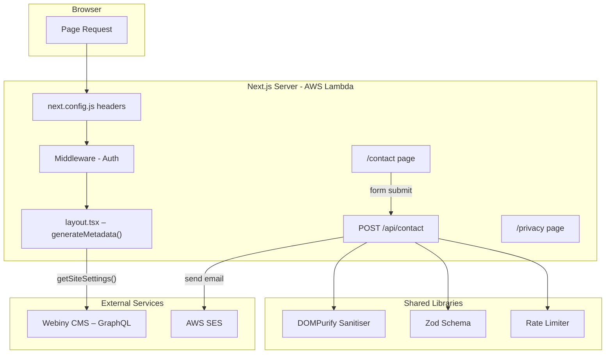

# Design Document: Site Polish and Contact

## Overview

This feature delivers four complementary enhancements to the James Williams Music website:

1. **Dynamic Favicon & Title** — Pulls the favicon URL and artist name from the Webiny CMS Site Settings model so they can be changed without redeployment.
2. **Contact Page & Form API** — Provides a `/contact` page with a server-validated form that sends enquiry notifications via AWS SES, protected by rate limiting and honeypot spam filtering.
3. **Privacy Policy Page** — Adds a `/privacy` page meeting Australian Privacy Act 1988 requirements.
4. **Security Headers** — Implements CSP, HSTS, COOP, X-Frame-Options, X-Content-Type-Options, and Referrer-Policy via `next.config.js` headers.

All components integrate with existing infrastructure: Webiny GraphQL API, the in-memory sliding-window rate limiter, Zod validation schemas, and the Lambda + CloudFront deployment pipeline.

### Key Design Decisions

| Decision | Rationale |
|----------|-----------|
| Use `generateMetadata()` in root layout for dynamic favicon/title | Next.js 14 App Router pattern; avoids client-side rendering for SEO |
| Extend existing `GET_SITE_SETTINGS` query to include `favicon` field | Minimal CMS change; reuses established `getSiteSettings()` function |
| Security headers in `next.config.js` `headers()` rather than middleware | Headers function applies to all routes including static assets; middleware matcher currently excludes `_next/static` and API routes |
| In-memory rate limiter reuse (not DynamoDB) | Single Lambda instance already uses this pattern; contact form is low-throughput |
| AWS SES for email delivery | Already in the AWS ecosystem; no additional vendor; region matches deployment |
| Honeypot over CAPTCHA | Meets "no JS required" criterion; invisible to humans; no third-party dependency |
| Static privacy policy page (not CMS-sourced) | Legal content changes infrequently; avoids CMS dependency for compliance page |
| `fast-check` for property-based testing | Well-maintained, TypeScript-native PBT library compatible with Jest |

---

## Architecture



---

## Components and Interfaces

### 1. Webiny Site Settings Extension

**File:** `src/lib/webiny/types.ts` — Add `favicon` field:

```typescript
export interface SiteSettings {
  id: string;
  artistName: string;
  favicon?: string;  // NEW – URL from CMS or undefined
  copyright: string;
  instagramUrl?: string;
  spotifyUrl?: string;
  appleMusicUrl?: string;
  youtubeUrl?: string;
  tiktokUrl?: string;
}
```

**File:** `src/lib/webiny/queries.ts` — Update `GET_SITE_SETTINGS` to include `favicon` in values selection set.

**File:** `src/lib/webiny/mock-data.ts` — Add `favicon` to mock site settings.

### 2. Metadata Helper Utilities

**File:** `src/lib/metadata/helpers.ts`

```typescript
const DEFAULT_ARTIST_NAME = 'James Williams';
const DEFAULT_FAVICON = '/favicon.ico';
const MAX_TITLE_LENGTH = 60;

export function resolveArtistName(settings: SiteSettings | null): string {
  const name = settings?.artistName?.trim();
  return name || DEFAULT_ARTIST_NAME;
}

export function resolveFavicon(settings: SiteSettings | null): string {
  const favicon = settings?.favicon?.trim();
  return favicon || DEFAULT_FAVICON;
}

export function truncateTitle(artistName: string, pageName: string, maxLength = MAX_TITLE_LENGTH): string {
  const separator = ' | ';
  const full = `${artistName}${separator}${pageName}`;
  if (full.length <= maxLength) return full;

  const available = maxLength - artistName.length - separator.length - 1; // 1 char for ellipsis
  if (available <= 0) return artistName.slice(0, maxLength);
  return `${artistName}${separator}${pageName.slice(0, available)}…`;
}
```

### 3. Root Layout (Dynamic Metadata)

**File:** `src/app/layout.tsx`

Convert static `metadata` to `generateMetadata()`:

```typescript
import { getSiteSettings } from '@/lib/webiny/api';
import { resolveArtistName, resolveFavicon } from '@/lib/metadata/helpers';

export async function generateMetadata(): Promise<Metadata> {
  let settings: SiteSettings | null = null;
  try {
    settings = await getSiteSettings();
  } catch {
    // CMS unreachable — use defaults
  }

  const artistName = resolveArtistName(settings);
  const faviconUrl = resolveFavicon(settings);

  return {
    title: { default: artistName, template: `${artistName} | %s` },
    description: 'Tour dates, music, and merch from James Williams.',
    icons: { icon: faviconUrl },
  };
}
```

Child pages export `metadata.title` as a string and Next.js applies the template automatically.

### 4. Contact Page

**File:** `src/app/contact/page.tsx`

Server component with `generateMetadata` for the "Contact" page title. Renders the `ContactForm` component.

### 5. Contact Form Component

**File:** `src/components/contact/ContactForm.tsx`

A client component (`'use client'`) that:
- Renders `name`, `email`, `subject`, `message` fields with labels
- Includes a honeypot field (`name="website"`) positioned off-screen via `className="absolute -left-[9999px]"`
- Displays a consent statement: "By submitting this form, you consent to your data being used solely to respond to your enquiry."
- Includes a link to `/privacy`
- Uses `useFormState` / `useActionState` for progressive enhancement (works without JS via standard form POST)
- Displays field-level errors and success/rate-limit messages inline

### 6. Contact API Route

**File:** `src/app/api/contact/route.ts`

```typescript
export async function POST(request: NextRequest): Promise<NextResponse>
```

Flow:
1. Rate limit check via `contactLimiter(request)`
2. Parse JSON body
3. Honeypot check — if `body.website` is non-empty, return fake success `{ message: "Thank you" }`
4. Validate with `contactFormSchema.safeParse()`
5. Sanitise all string fields via `stripHtml()`
6. Send email via `sendContactEmail()`
7. Return success or error response

### 7. Contact Form Validation Schema

**File:** `src/lib/validation/contact.ts`

```typescript
import { z } from 'zod';

export const contactFormSchema = z.object({
  name: z.string()
    .min(1, 'Name is required')
    .max(100, 'Name must be at most 100 characters')
    .transform(v => v.trim()),
  email: z.string()
    .email('Please enter a valid email address')
    .max(254, 'Email must be at most 254 characters')
    .transform(v => v.trim().toLowerCase()),
  subject: z.string()
    .max(200, 'Subject must be at most 200 characters')
    .optional()
    .default('')
    .transform(v => v.trim()),
  message: z.string()
    .min(10, 'Message must be at least 10 characters')
    .max(2000, 'Message must be at most 2000 characters')
    .transform(v => v.trim()),
});

export type ContactFormInput = z.infer<typeof contactFormSchema>;
```

### 8. Email Service (AWS SES)

**File:** `src/lib/email/ses.ts`

```typescript
import { SESClient, SendEmailCommand } from '@aws-sdk/client-ses';

const ses = new SESClient({ region: process.env.AWS_REGION ?? 'ap-southeast-2' });

export interface ContactEmailData {
  name: string;
  email: string;
  subject: string;
  message: string;
}

export async function sendContactEmail(data: ContactEmailData): Promise<void> {
  const command = new SendEmailCommand({
    Source: process.env.SES_FROM_EMAIL!,
    Destination: { ToAddresses: [process.env.CONTACT_RECIPIENT_EMAIL!] },
    Message: {
      Subject: { Data: `Contact Form: ${data.subject || 'New Enquiry'}` },
      Body: {
        Text: {
          Data: `Name: ${data.name}\nEmail: ${data.email}\nSubject: ${data.subject || 'N/A'}\n\nMessage:\n${data.message}`,
        },
      },
    },
  });
  await ses.send(command);
}
```

**New dependency:** `@aws-sdk/client-ses`

### 9. Input Sanitisation

**File:** `src/lib/sanitize/index.ts`

```typescript
import DOMPurify from 'isomorphic-dompurify';

export function stripHtml(input: string): string {
  return DOMPurify.sanitize(input, { ALLOWED_TAGS: [] });
}
```

### 10. Contact Rate Limiter

**File:** `src/lib/rate-limit/limiter.ts` — Add to existing file:

```typescript
/** Contact form: 5 submissions per 15 minutes */
export const contactLimiter = createRateLimiter({
  windowMs: 15 * 60 * 1000,
  maxAttempts: 5,
});
```

### 11. Privacy Policy Page

**File:** `src/app/privacy/page.tsx`

Static server component containing:
- What data is collected (name, email, subject, message)
- Purpose: responding to enquiries only
- Storage: AWS ap-southeast-2, encrypted at rest, access-restricted
- Retention: 90 days, then deleted
- Rights under Australian Privacy Act 1988 (access, correction, OAIC complaint)
- Contact method for privacy enquiries
- Last updated date

### 12. Security Headers

**File:** `next.config.js` — Add `headers()` async function:

```javascript
async headers() {
  return [
    {
      source: '/(.*)',
      headers: [
        {
          key: 'Content-Security-Policy',
          value: [
            "default-src 'self'",
            "script-src 'self'",
            "style-src 'self' 'unsafe-inline'",
            "img-src 'self' *.cloudfront.net *.amazonaws.com images.unsplash.com media.base44.com data:",
            "font-src 'self'",
            "connect-src 'self' *.amazonaws.com",
            "frame-src 'self' open.spotify.com",
            "frame-ancestors 'self'",
          ].join('; '),
        },
        { key: 'Strict-Transport-Security', value: 'max-age=63072000; includeSubDomains; preload' },
        { key: 'Cross-Origin-Opener-Policy', value: 'same-origin' },
        { key: 'X-Content-Type-Options', value: 'nosniff' },
        { key: 'Referrer-Policy', value: 'strict-origin-when-cross-origin' },
        { key: 'X-Frame-Options', value: 'SAMEORIGIN' },
      ],
    },
  ];
}
```

Notes:
- `style-src 'unsafe-inline'` is needed for Tailwind CSS v4 runtime styles
- `script-src` does NOT include `'unsafe-inline'` (per requirement 6.5)
- `frame-src` allows Spotify embeds for existing album pages
- CSP may require nonce-based approach if Next.js inline scripts cause issues in production

---

## Data Models

### SiteSettings (Extended)

| Field | Type | Source | Notes |
|-------|------|--------|-------|
| `favicon` | `string \| undefined` | Webiny CMS `listSiteSettingsPlural.values.favicon` | New field |
| All existing fields | — | — | Unchanged |

### ContactFormInput

| Field | Type | Constraints | Required |
|-------|------|-------------|----------|
| `name` | `string` | 1–100 chars after trim | Yes |
| `email` | `string` | Valid email format, max 254 chars | Yes |
| `subject` | `string` | 0–200 chars | No |
| `message` | `string` | 10–2000 chars after trim | Yes |

### API Response Shape

```typescript
// Success
{ message: string }

// Validation Error (400)
{ error: { code: 'VALIDATION_ERROR', fields: Record<string, string[]> } }

// Rate Limited (429)
{ error: { code: 'RATE_LIMITED', message: string, retryAfterMinutes: number } }

// Server Error (500)
{ error: { code: 'SEND_FAILED', message: string } }
```

### Environment Variables (New)

| Variable | Purpose |
|----------|---------|
| `SES_FROM_EMAIL` | Verified SES sender address |
| `CONTACT_RECIPIENT_EMAIL` | Where contact form notifications are delivered |

---

## Correctness Properties

*A property is a characteristic or behavior that should hold true across all valid executions of a system — essentially, a formal statement about what the system should do. Properties serve as the bridge between human-readable specifications and machine-verifiable correctness guarantees.*

### Property 1: Favicon Resolution

*For any* input value (string, null, or undefined), `resolveFavicon` SHALL return the trimmed input string when it is a non-empty string after trimming, and SHALL return `"/favicon.ico"` otherwise.

**Validates: Requirements 1.1, 1.2**

### Property 2: Artist Name Resolution

*For any* input value (string, null, or undefined), `resolveArtistName` SHALL return the trimmed input string when it is a non-empty string after trimming, and SHALL return `"James Williams"` otherwise.

**Validates: Requirements 2.1, 2.2**

### Property 3: Title Truncation Invariant

*For any* pair of strings (artistName, pageName), `truncateTitle(artistName, pageName)` SHALL produce an output that: (a) never exceeds 60 characters in length, (b) starts with the artistName followed by " | ", and (c) if truncation was needed, the pageName portion ends with "…".

**Validates: Requirements 2.3, 2.4**

### Property 4: Contact Form Schema Validation

*For any* form input object, the `contactFormSchema` SHALL accept the input if and only if: name is a non-empty string ≤ 100 chars after trim, email is a valid email ≤ 254 chars, message is between 10–2000 chars after trim, and subject (if provided) is ≤ 200 chars. When validation fails, the returned error SHALL identify each invalid field with a descriptive reason.

**Validates: Requirements 3.2, 3.7, 3.11, 3.13**

### Property 5: Input Sanitisation Strips HTML

*For any* input string, after sanitisation with `stripHtml()`, the output SHALL not contain any HTML tags (`<...>`) or `<script>` content, while preserving the plain text content of the input.

**Validates: Requirements 3.8**

### Property 6: Honeypot Silent Rejection

*For any* form submission where the honeypot field contains a non-empty string, the API SHALL return a response identical in structure and status code to a successful submission, and SHALL NOT invoke the email service.

**Validates: Requirements 4.4**

---

## Error Handling

| Scenario | Handling | User Impact |
|----------|----------|-------------|
| CMS unreachable / timeout | Catch in `generateMetadata`, use fallback values | None — defaults displayed |
| SES send failure | Log error, return 500 with generic message | "Unable to send message. Please try again later." |
| Rate limit exceeded | Return 429 with `Retry-After` header and `retryAfterMinutes` | Inline message: "Too many submissions. Please try again in X minutes." |
| Zod validation failure | Return 400 with per-field errors | Field-level error messages displayed inline |
| Honeypot triggered | Return 200 with success message (silent rejection) | Bot cannot distinguish from real success |
| Invalid email format | Zod rejects at schema level | "Please enter a valid email address" |
| CSP blocks resource | Browser console warning | Third-party embed may not load; CSP tuned for known origins |

---

## Testing Strategy

### Unit Tests (Jest)

- **Metadata helpers** (`resolveArtistName`, `resolveFavicon`, `truncateTitle`): Specific examples, edge cases (empty, null, very long, unicode)
- **Contact schema**: Valid/invalid inputs, boundary values at min/max lengths
- **Sanitisation**: Representative HTML payloads, script injection attempts
- **API route logic**: Mock SES and rate limiter; test happy path, validation errors, honeypot, SES failure
- **Security headers config**: Snapshot test ensuring all required headers present

### Property-Based Tests (fast-check)

This feature is suitable for property-based testing because the core logic involves pure functions (metadata resolution, schema validation, sanitisation) with clear input/output behavior and large input spaces.

**Library:** `fast-check` (TypeScript PBT library)

**Configuration:** Minimum 100 iterations per property test.

**Tag format:** `Feature: site-polish-and-contact, Property {N}: {title}`

| Property | Test Target | Generator Strategy |
|----------|-------------|-------------------|
| 1: Favicon Resolution | `resolveFavicon` | `fc.option(fc.oneof(fc.string(), fc.constant(''), fc.stringOf(fc.constant(' '))))` |
| 2: Artist Name Resolution | `resolveArtistName` | Same generator as Property 1 |
| 3: Title Truncation | `truncateTitle` | `fc.tuple(fc.string({minLength:1, maxLength:30}), fc.string({minLength:1, maxLength:100}))` |
| 4: Schema Validation | `contactFormSchema.safeParse` | Custom generators for valid/invalid ContactFormInput |
| 5: Sanitisation | `stripHtml` | `fc.string()` with injected HTML tags via `fc.oneof` |
| 6: Honeypot Rejection | API route handler | `fc.string({minLength:1})` for honeypot, valid data for other fields |

### Integration Tests

- Contact form end-to-end flow with mocked SES
- Rate limiter behaviour across multiple sequential requests from same IP
- CMS failure scenario (timeout, network error) → fallback metadata

### Accessibility Tests (jest-axe)

- Contact form: all inputs have associated labels, errors linked via `aria-describedby`, focus management after submission
- Privacy page: heading hierarchy, landmark regions, readable text structure
